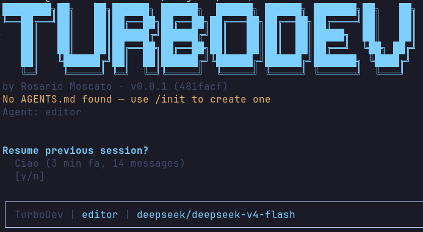

# AGENTS.md

## Project Overview

<!-- Describe your project here -->

> # TurboDev

**Terminal-based AI coding agent** — il tuo coding partner nel terminale.

  

## Cos'è

TurboDev è un agente AI per il coding che funziona interamente nel terminale. Permette di chattare con modelli LLM (via OpenRouter), eseguire tool, gestire file e codice — tutto senza uscire dalla CLI.

## Funzionalità

- **Chat AI nel terminale** — conversa con modelli LLM in tempo reale con streaming

## Setup Commands

- Install dependencies: `npm install`
- Start dev server: `npm run dev`
- Build: `npm run build`
- Start: `npm run start`
- Run tests: `npm test`

## Code Style

<!-- Add your code style guidelines here -->

## Testing Instructions

- Run tests: `npm test`
- Fix any test failures before committing
