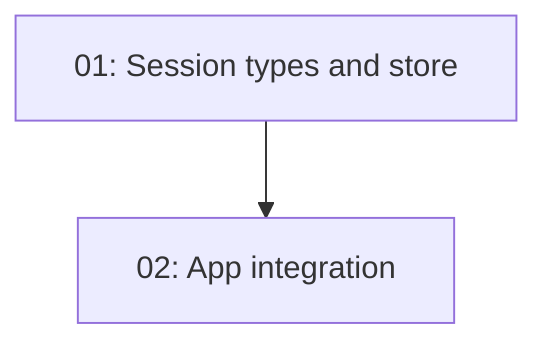

# Session Persistence

## Overview

Persist TurboDev conversations to disk so users can resume sessions across restarts. Sessions are stored as JSON files in `.turbodev/sessions/` within the project directory. On startup, the last session auto-loads. New sessions can be created with `/new`, previous sessions listed with `/sessions`.

## Quick Links

- [Requirements](./requirements.md)
- [Action Required](./action-required.md)

## Dependency Graph

## Waves

| Wave | Tasks | Description |
|------|-------|-------------|
| 1 | task-01 | Session types and file store |
| 2 | task-02 | App.tsx integration + commands |

## Task Status

### Wave 1
- [ ] [task-01-session-store](./tasks/task-01-session-store.md) — Session types and file store

### Wave 2
- [ ] [task-02-app-integration](./tasks/task-02-app-integration.md) — App integration and commands
